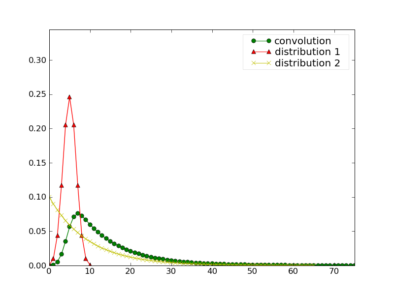
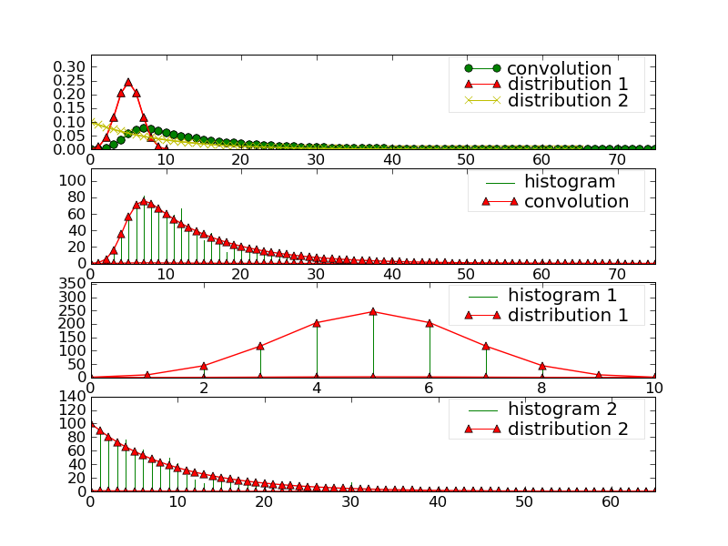

.. define some aliases:
.. _histogram_tutorial: tutorial.html#id1

.. define the setup for doctest:
.. testsetup:: *
   
    from openalea.stat_tool import *
    import pylab
    from pylab import savefig, clf

ref:`Convolution`

Convolution
===========

Here is a brief description of the Convolution type, which uses notions
introduced in the histogram_tutorial_ section, which is recommended to look at first. 

Constructor
-----------

Similarly to the histogram case, there are two constructors for the 
:func:`~openalea.stat_tool.convolution.Convolution` class that are used as 
follows:

.. doctest::

    >>> d1 = Binomial(0, 10, 0.5)
    >>> d2 = NegativeBinomial(0, 1, 0.1)
    >>> conv1 = Convolution(d1, d2)
     
and

.. doctest:: 

    >>> conv2 = Convolution('./test/convolution1.conv') #doctest: +SKIP

In the first example, which we'll use later on, one create the convolution of 
two :func:`~openalea.stat_tool.distribution.Distribution` that are a 
:func:`~openalea.stat_tool.distribution.Binomial` and 
:func:`~openalea.stat_tool.distribution.NegativeBinomial` distributions.

The convolution as well as the original distributions are stored within the
Convolution instance. We will see how to extract the original distributions later
on.

In order to display the contents, or to save the data, one uses the same functions
/methods as in the Histogram case.

  
plotting
--------

.. doctest::
    
    >>> clf()
    >>> conv1.plot(show=False)
    >>> savefig('doc/user/stat_tool_convolution_plot1.png')

The following figure gather the original distribution and the convolution within 
a single plot. 
    

It is easy to extract only the relevant distribution and to plot it. You need to 
use the **Extract**-like functions/methods:

.. doctest::

    >>> clf();
    >>> d1_bis = Extract(conv1, "Elementary",1).plot(show=False)
    >>> savefig('doc/user/stat_tool_convolution_plot2.png')
    
    >>> clf();
    >>> d2_bis = Extract(conv1, "Elementary",2).plot(show=False)
    >>> savefig('doc/user/stat_tool_convolution_plot3.png')
    
    >>> clf();
    >>> conv1_bis = Extract(conv1, "Convolution").plot(show=False)
    >>> savefig('doc/user/stat_tool_convolution_plot4.png')
    
 
+--------------------------------------------+---------------------------------------------+
| .. image:: stat_tool_convolution_plot1.png | .. image:: stat_tool_convolution_plot2.png  |
|     :width: 100%                           |     :width: 100%                            |   
+--------------------------------------------+---------------------------------------------+
| .. image:: stat_tool_convolution_plot3.png | .. image:: stat_tool_convolution_plot4.png  |
|     :width: 100%                           |     :width: 100%                            |
+--------------------------------------------+---------------------------------------------+   

Simulate
--------

Once you have a Convolution, you can simulate a data set using:

.. doctest::

    >>> simulation = Simulate(conv1, 10)
 
and compare the resulting data with the original one. This comparison can be
done visually:

.. doctest::

    >>> simulation.plot(show=False)
    >>> Simulate(conv1,1000).plot(show=False) # equivalent to the line above 
    >>> savefig('doc/user/stat_tool_convolution_plot5.png')
    

    
    

 

