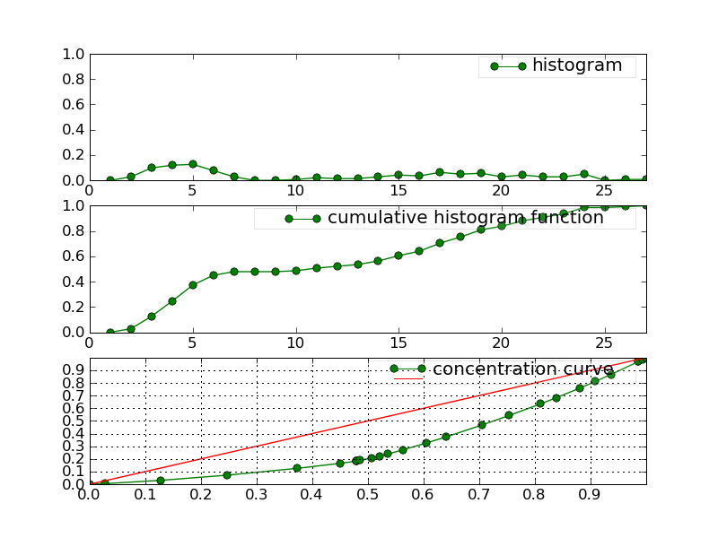

.. define some aliases:
.. _histogram: syntax.html#type-histogram

.. define the setup for doctest:
.. testsetup:: *

    from openalea.stat_tool import *
    import pylab
    from pylab import savefig, clf
    h1 = Histogram('./test/data/meri1.his')
    h5 = Histogram('./test/data/meri5.his')

Histogram
=========

Here is a brief description of the Histogram type.

Constructor
-----------

Histogram like most of the objects available can be generated by loading an
ASCII file -- following the syntax given in histogram_ -- or with a list of
values, that will be processed into an histogram.

For instance, let us suppose that you have a valid ASCII file, then simply
load it using the :func:`~openalea.stat_tool.histogram.Histogram` class so as
to create an instance of Histogram

.. filename with respect to the directory where sphinx is launch

.. doctest::

    >>> h1 = Histogram('./test/data/meri1.his')

Otherwise, you can construct an histogram from scratch providing a list of
numbers. The following example takes a list of numbers, construct its histogram
and returns the latter into an instance of :func:`Histogram`:

.. doctest::

    >>> h2 = Histogram([1,2,2,3,4,4,4,5])

Now, you can use the methods bounded to the `Histogram` class.

Display
-------

The object `h` has a few methods among which some are useful to print
information on the screen or in a file. The `Display` method
:func:`~openalea.stat_tool.output.Display` is one of them. This methods works
as follows:

.. doctest::

    >>> h1.display()
    'frequency distribution - sample size: 76\nmean: 18.0263   variance: 18.4526   standard deviation: 4.29565\ncoefficient of skewness: -0.370952   coefficient of kurtosis: -0.0181747\nmean absolute deviation: 3.3705   coefficient of concentration: 0.132789\ninformation: -207.685 (-2.7327)\n'
    >>> Display(h1)
    'frequency distribution - sample size: 76\nmean: 18.0263   variance: 18.4526   standard deviation: 4.29565\ncoefficient of skewness: -0.370952   coefficient of kurtosis: -0.0181747\nmean absolute deviation: 3.3705   coefficient of concentration: 0.132789\ninformation: -207.685 (-2.7327)\n'

.. note:: Note here that you can call the methods in two different ways.
    :func:`Display` is in fact a layer above h1.display(). We advice you to use
    this function instead of the methods *.display*. The function *Display* will
    indeed allow you to add extra layer of robustness and flexibility over the
    methods (because the function is written in python). There are a few
    functions like that (Save, Display, Estimate, Simulate) that we will see
    in this tutorial.

There is another method that is very similar to Display, that is called
**ascii_write**. It prints ASCII information on the screen as well, but with a
nicer layout by taking the special character '\n' into account:

.. doctest::

    >>> print h1.ascii_write(True) #doctest: +SKIP
    >>> print h1.ascii_write(False) #doctest: +SKIP
    histogram - sample size: 66
    mean: 4.37879   variance: 1.62354   standard deviation: 1.27418
    coefficient of skewness: 0.0727983   coefficient of kurtosis: -0.709664
    mean absolute deviation: 1.06841   coefficient of concentration: 0.161214
    information: -107.512 (-1.62897)

If the :func:`str` function is implemented, you can again obtain the same kind
of results using :

.. doctest::

    >>> str(h1)  # equivalent to Display(h1)
    'frequency distribution - sample size: 76\nmean: 18.0263   variance: 18.4526   standard deviation: 4.29565\ncoefficient of skewness: -0.370952   coefficient of kurtosis: -0.0181747\nmean absolute deviation: 3.3705   coefficient of concentration: 0.132789\ninformation: -207.685 (-2.7327)\n'
    >>> print str(h1) # equivalent to print Display(h1) or h1.file_ascii_write(False)
    frequency distribution - sample size: 76
    mean: 18.0263   variance: 18.4526   standard deviation: 4.29565
    coefficient of skewness: -0.370952   coefficient of kurtosis: -0.0181747
    mean absolute deviation: 3.3705   coefficient of concentration: 0.132789
    information: -207.685 (-2.7327)
    <BLANKLINE>

Saving
------

In the constructor section, we've seen that we can load an histogram from an
ASCII file. So, the next step is to know how to save an histogram.

Let us continue using the **h1** variable. Saving, can be done in two equivalent
ways using the :func:`~openalea.stat_tool.output.Save` function or the save methods:

.. doctest::
    :options: +SKIP

    >>> h1.save('test.dat')
    >>> Save(h1, 'test.dat')

Then, you can construct a new instance as follows:

.. doctest::
    :options: +SKIP

    >>> dummy = Histogram('test.dat')

Plotting
--------

old AML style

.. doctest::
    :options: +SKIP

    h.old_plot()

new style, either with GNUPLOT or MATPLOTLIB. By default, matplotlib is used if
it is implemented:

.. doctest::

    >>> clf()
    >>> h1.plot(show=False)
    >>> savefig('doc/user/stat_tool_histogram_plot.png')
    >>> # by default, the Plot routine uses matplolib (if available)
    >>> # but you can still use gnuplot
    >>> plot.set_plotter(plot.gnuplot()) #doctest: +SKIP
    >>> # and come back to matplotlib later on
    >>> plot.set_plotter(plot.mtplotlib()) #doctest: +SKIP

.. figure:: stat_tool_histogram_plot.png
    :width: 50%
    :align: center

There are other methods related to GNUPLOT that we will not supported anymore
in the future::

    >>> h1.plot_write('output', 'title')
    >>> h1.print_plot() # save gnuplot output in a postscript file

Clustering
----------

Histograms can be clustered. See :func:`~openalea.stat_tool.cluster.Cluster`

.. doctest::
    :options: +SKIP

    >>> h1.cluster_information(0.5)
    # equivalently
    >>> Cluster(h1, "Information", 0.5)
    >>> h1.cluster_limit([1,2])
    # equivalently
    >>> Cluster(h1, "Limit", [1,2])
    >>> h1.cluster_step(3)
    # equivalently
    >>> Cluster(h1, "Step", 3)

.. warning:: Again, although the function is equivalent to the method, we
    advice you to use the functions. See Display section for details.

Merging
-------

the following examples illustrates the usage of the
:func:`~openalea.stat_tool.data_transform.Merge` function. See also
Figure :ref:`fig_merging` for the output plots.

.. doctest::

    >>> # load two histograms
    >>> h1 = Histogram('./test/data/meri1.his')
    >>> clf(); h1.plot(show=False); savefig('doc/user/stat_tool_histogram_h1.png')
    >>> h5 = Histogram('./test/data/meri5.his')
    >>> clf(); h5.plot(show=False); savefig('doc/user/stat_tool_histogram_h5.png')

The two original histograms are shown here below:

+---------------------------------------+----------------------------------------+
| .. image:: stat_tool_histogram_h1.png | .. image:: stat_tool_histogram_h5.png  |
|     :width: 100%                      |     :width: 100%                       |
+---------------------------------------+----------------------------------------+

.. doctest::

    >>> a = Merge(h1,h5)
    >>> b= h1.merge([h5])
    >>> c = h5.merge([h1])
    >>> clf(); a.plot(show=False)
    >>> savefig('doc/user/stat_tool_histogram_merging.png')

.. _fig_merging:

    **Figure: The merging of two histograms**

