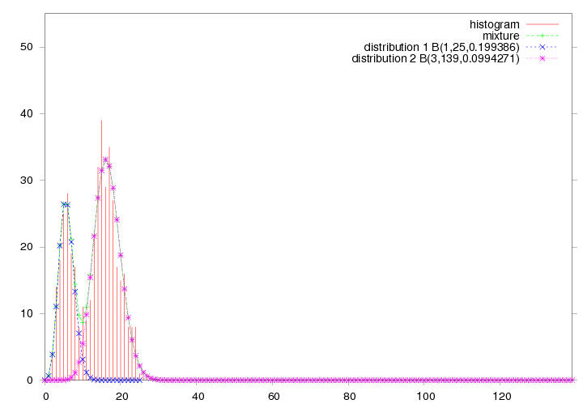
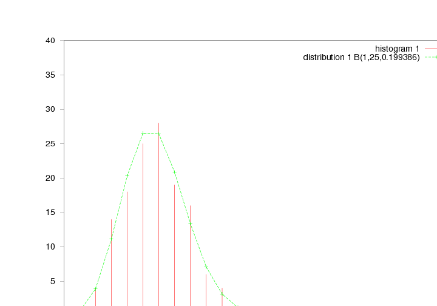

Usage Example
=============

This is a simple example to illustrate the usage of plotting (gnuplot)

.. literalinclude:: plotting.py

This scripts generates 4 images two of which are here below:

    

